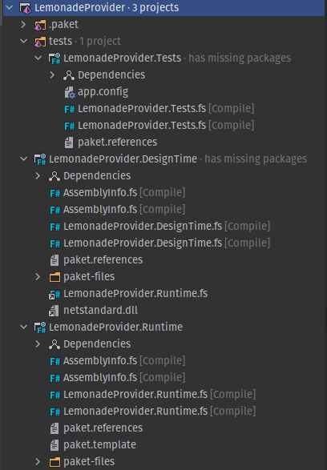

## What is this?

This is a heavily tweaked template project, initially generated with [FSharp.TypeProviders.SDK](https://github.com/fsprojects/FSharp.TypeProviders.SDK/).
Tweaks include simpler project structure and complete removal of paket. 

## Why would you do that?

Because original template does not work with Rider on Linux. 

_I have no idea what's happening above, it's completely broken_

Autocomplete is not working, unit-tests are not detected by IDE, 
and paket is not supported by Rider at this point.

I like Rider and I like Linux, so here we are

## Should I use this project instead of original?

Probably not. It's far from perfection, to be honest. Besides, the original project is distributed 
as `dotnet new` template, it has better support and the maintainers actually know what they are doing. 
I made this just to solve my particular problem in my environment. However, if you happened to run into 
similar problems like I did, this project could be a reference for you to work around those issues.

## Why `WaterProvider`?

Original repository uses `LemonadeProvider` as an example. I just kept same spirit.

## License

This template/sample code is published under terms of [MIT License](LICENSE.md). 

The template includes source code from [FSharp.TypeProviders.SDK](https://github.com/fsprojects/FSharp.TypeProviders.SDK/), that was originally published
under terms of [MIT License](https://github.com/fsprojects/FSharp.TypeProviders.SDK/blob/master/LICENSE.md):

 - [`ProvidedTypes.fs`](WaterProvider.Runtime/ProvidedTypes.fs) - [original](https://github.com/fsprojects/FSharp.TypeProviders.SDK/blob/579c6474805c99be5a764a9521e3a59fd28e9d7a/src/ProvidedTypes.fs)
 - [`ProvidedTypes.fsi`](WaterProvider.Runtime/ProvidedTypes.fsi) - [original](https://github.com/fsprojects/FSharp.TypeProviders.SDK/blob/579c6474805c99be5a764a9521e3a59fd28e9d7a/src/ProvidedTypes.fsi)
